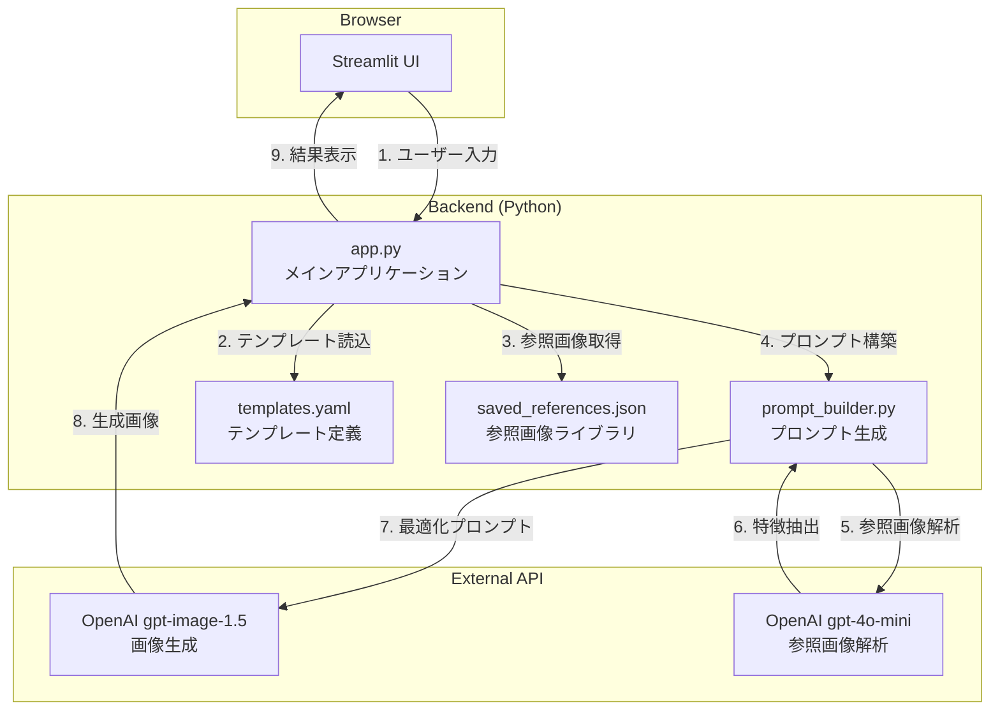
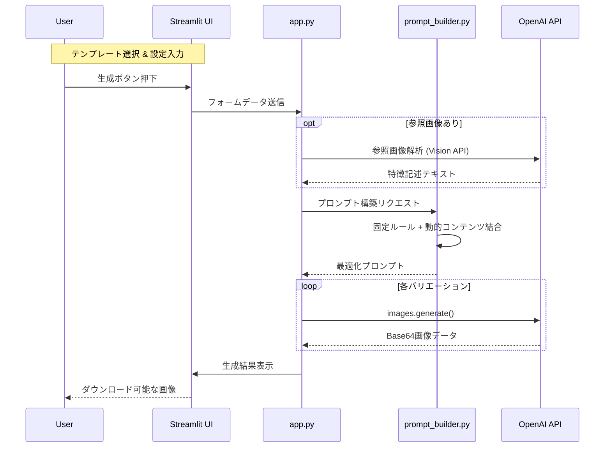

# 🌙 月ねこバナーメーカー (Tsukineko Banner Maker)

> **「バナー制作をもっと意図通りに、ChatGPT imagesと一緒に。」**
>
> OpenAI gpt-image-1.5 を活用した、テンプレート駆動型バナー生成ツール。公式プロンプトガイドを参考に。
>
> ChatGPT Images は“プロンプトの型”を守るほど再現性が上がる。
>
> でも 型が長くなって、人力運用がしんどい。
>
> だから テンプレ・パレット・サイズ・参照画像をUI化して、「難しい構図ほど分解して作れる」ようにした。
>
> 結果、技術検証（条件を固定して比較）と実務量産が同じ土俵で回るようになった。
> 
> （参考）プロンプトガイド公式ガイド：https://cookbook.openai.com/examples/multimodal/image-gen-1.5-prompting_guide


---

## 📖 プロジェクト概要

**月ねこバナーメーカー**は、最新のAI画像生成モデル `gpt-image-1.5` を活用し、テンプレートシステムと参照画像機能を組み合わせることで、**一貫性のあるプロ品質バナー**を簡単に作成できるWebアプリケーションです。

従来のAI画像生成ツールでは困難だった「テキストの正確な描画」「スタイルの一貫性維持」「複数バリエーションの一括生成」を実現しています。

---

## ✨ 主な機能

### 1. 🎨 参照画像ライブラリ

3種類の参照画像を保存・選択して、生成スタイルを視覚的に指定：

| タイプ | 用途 | 効果 |
|--------|------|------|
| **キャラクター** | マスコット・人物 | キャラクターデザインを維持 |
| **背景** | 風景・シーン | 世界観・雰囲気を再現 |
| **スタイル** | テクスチャ・装飾 | 画風・質感を反映 |

### 2. 📋 12種類のテンプレート

目的別に最適化されたプリセットで、ワンクリック生成：

- **Generate系 (8種)**: 新規バナーの一括生成
- **Edit系 (4種)**: 既存画像の部分編集

### 3. ✏️ 正確なテキスト描画

`text_verbatim` 機能で、バナー内のテキストを**完全一致**で描画。スペルミスや文字化けを防止。

### 4. 🔄 バリエーション一括生成

1回のクリックで複数パターンを自動展開：
- 構図バリエーション（正面・斜め・横顔）
- 季節バリエーション（春夏秋冬）
- 配色バリエーション（暖色・寒色・ナチュラル）

---

## 🛠 システムアーキテクチャ

本アプリケーションは、Streamlit をベースに構築されたシングルページアプリケーションです。



### アーキテクチャの特徴

- **テンプレート駆動**: `templates.yaml` でテンプレートを定義し、UIとプロンプトを自動生成
- **プロンプトエンジニアリング**: `prompt_builder.py` で固定ルールと動的コンテンツを組み合わせ
- **参照画像解析**: Vision API で参照画像の特徴を抽出し、プロンプトに反映
- **セッション管理**: Streamlit の `session_state` で状態を永続化

---

## 🔄 処理シーケンス

ユーザーがバナーを生成するまでのフローです。



---

## 💻 技術スタック

| Category | Technology | Version | Usage |
|:---------|:-----------|:--------|:------|
| **Framework** | **Streamlit** | 1.52+ | UI & セッション管理 |
| **Language** | **Python** | 3.11+ | バックエンドロジック |
| **AI Model** | **gpt-image-1.5** | - | 画像生成 |
| **AI Model** | **gpt-4o-mini** | - | 参照画像解析 (Vision) |
| **Image** | **Pillow** | 11.0+ | 画像処理・変換 |
| **Config** | **PyYAML** | 6.0+ | テンプレート定義 |
| **Env** | **python-dotenv** | 1.0+ | 環境変数管理 |

---

## 📂 ディレクトリ構造

```
tsukineko-banner-maker/
├── app.py                    # メインアプリケーション
│                             # - UI構築 (Streamlit)
│                             # - OpenAI API連携
│                             # - 参照画像ライブラリ管理
│                             # - カスタムCSS (プレミアムデザイン)
│
├── prompt_builder.py         # プロンプト生成エンジン
│                             # - 固定ルール (英語ブロック)
│                             # - 動的コンテンツ構築
│                             # - ネガティブプロンプト
│
├── templates.yaml            # テンプレート定義
│                             # - Generate系 8種
│                             # - Edit系 4種
│                             # - フィールド定義
│
├── assets/
│   ├── character.png         # マスコットキャラクター
│   └── saved_references/     # 保存済み参照画像
│       ├── ref_001.png
│       └── ...
│
├── saved_references.json     # 参照画像メタデータ
├── requirements.txt          # Python依存パッケージ
├── Dockerfile                # コンテナ化用
├── .env.example              # 環境変数サンプル
├── .gitignore                # Git除外設定
└── README.md                 # このファイル
```

---

## 🚀 ローカルでの実行方法

### 1. 前提条件

- Python 3.11 以上
- OpenAI API Key（gpt-image-1.5 利用には組織認証が必要）

### 2. インストール

```bash
git clone https://github.com/nekoai-lab/tsukineko-banner-maker.git
cd tsukineko-banner-maker
pip install -r requirements.txt
```

### 3. 環境変数の設定

```bash
cp .env.example .env
```

`.env` ファイルを編集して API キーを設定：

```env
OPENAI_API_KEY=sk-proj-xxxxxxxx
```

### 4. 実行

```bash
streamlit run app.py
```

ブラウザで `http://localhost:8501` にアクセス

---

## 🐳 Docker での実行

```bash
# イメージのビルド
docker build -t tsukineko-banner-maker .

# コンテナの起動
docker run -p 8080:8080 -e OPENAI_API_KEY=sk-proj-xxx tsukineko-banner-maker
```

ブラウザで `http://localhost:8080` にアクセス

---

## 🎨 テンプレート一覧

### Generate系（新規生成）

| ID | テンプレート名 | 生成枚数 | 説明 |
|----|---------------|:--------:|------|
| t01 | キャラ統一バナー | 3枚 | 構図違いの3パターン |
| t02 | 文字入りバナー | 1枚 | テキスト完全一致描画 |
| t03 | 季節感バリエーション | 4枚 | 春夏秋冬の4パターン |
| t04 | 色違いバナー | 3枚 | 配色バリエーション |
| t05 | サイズ展開テンプレ | 3枚 | SNS用サイズセット |
| t06 | シンプルロゴバナー | 1枚 | 余白多めミニマル |
| t07 | 情報詰め込み型 | 1枚 | イベント告知向け |
| t08 | ミニマルデザイン | 1枚 | 要素最小限 |

### Edit系（画像編集）

| ID | テンプレート名 | 編集対象 | 説明 |
|----|---------------|:--------:|------|
| t09 | 色のみ変更 | color | 配色だけを変更 |
| t10 | テキストのみ変更 | text | テキスト部分を差し替え |
| t11 | 背景のみ変更 | background | 背景を差し替え |
| t12 | 小物追加 | add_element | 装飾を追加 |

---

## 🆚 AI画像生成モデルとの比較

| 機能 | gpt-image-1.5<br/>(本ツール) | DALL-E 3 | Gemini<br/>(Imagen 3) | Stable Diffusion |
|------|:------------------:|:--------:|:----------:|:----------:|
| 英語テキスト描画 | ✅ 非常に高い | △ 文字化けあり | ✅ 高い | △ 苦手 |
| 日本語テキスト描画 | △ 発展途上 | ❌ | ✅ 高い | ❌ |
| 日本語プロンプト理解 | ✅ 高い | ○ 普通 | ✅ 高い | △ 限定的 |
| 参照画像対応 | ✅ | ❌ | ✅ | ✅ ControlNet |
| 部分編集 (Inpaint) | ✅ | ❌ 全体再生成 | ✅ | ✅ |
| API利用 | ✅ | ✅ | ✅ | ✅ |
| ローカル実行 | ❌ | ❌ | ❌ | ✅ 無料 |
| 商用利用 | ✅ 明確 | ✅ 明確 | △ 要確認 | △ モデル依存 |
| 価格 | 高め | 中程度 | 低め | 無料〜 |

> ⚠️ **日本語テキスト描画について**: 現時点では全てのAIモデルで日本語（漢字・ひらがな）の描画精度は発展途上です。日本語テキストが必要な場合は、英語でバナーを生成後、画像編集ソフトでテキストを追加する方法を推奨します。

### 💡 gpt-image-1.5 を選ぶ理由

- **英語テキスト精度が最重要** → gpt-image-1.5 一択
- **コスト重視** → Gemini or Stable Diffusion
- **既存OpenAI環境との統合** → gpt-image-1.5 で統一が楽
- **完全オフライン運用** → Stable Diffusion

---

## ⚙️ 環境変数

| 変数名 | 必須 | 説明 |
|--------|:----:|------|
| `OPENAI_API_KEY` | ✅ | OpenAI API キー |
| `ENV` | - | 環境識別子 (development/production) |

---

## 🛡️ License & Credit

- **Development**: Developed by **nekoai-lab**
- **License**: MIT License

---

*Created with 🐱 & 🌙 by 月猫開発チーム*
